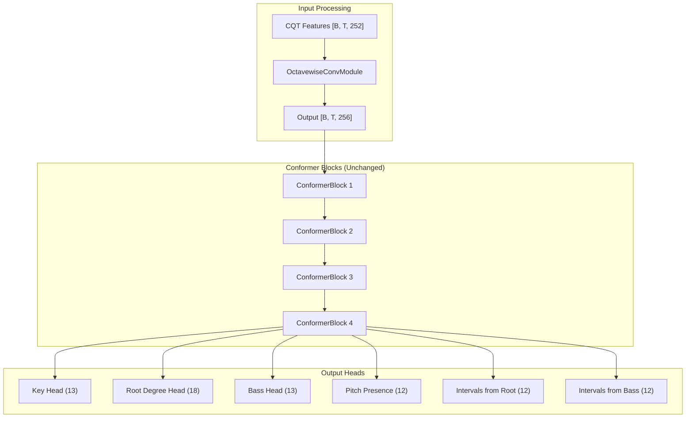

# MIREX 2025 Degree-Based Chord Recognition Implementation

**Overview:** Implement the MIREX 2025 degree-based chord recognition enhancements: Octavewise Convolution Module and 39-dimensional chord representation with key-relative scale degrees. This follows the paper exactly, removing the incorrectly-added Triad head from the original plan.

## Todos

| ID | Task | Status |
|----|------|--------|
| config-mirex | Add MIREX constants to config.py (hyperparams, augmentation probs, octavewise params) | pending |
| model-octavewise | Implement OctavewiseConvModule in model.py | pending |
| model-mirex | Create MIREXChordFormerModel with new output structure (no Triad head) | pending |
| feature-key-parse | Add key/confidence parsing and 70% filtering to feature_extraction.py | pending |
| dataset-mirex | Create MIREXChordFormerDataset with degree computation and pitch vectors | pending |
| dataset-augment | Add time-stretching augmentation (0.8x-1.2x, 50% prob) per MIREX paper | pending |
| train-mirex | Add MIREXLoss (CE + BCE) and training loop updates | pending |
| inference-mirex | Add degree-to-absolute + intervals_to_quality() + enharmonic spelling | pending |
| eval-mirex | Implement WCSR metrics via mir_eval + dataset size verification | pending |

---

## Summary of Corrections to PLAN_1.md

| Issue | PLAN_1.md (Incorrect) | Correction |
|-------|----------------------|------------|
| Triad output head | Included as separate head | **Remove** - paper uses pitch vectors instead |
| Scale degrees | 15 classes (inconsistent) | **18 classes** - full enharmonic distinction |
| Output dimensions | 6 heads (like original) | 3 categorical + 36 binary |
| Key source | Auto-detect only | Use existing `.lab` headers |
| Time-stretching | Not implemented | **Required** - 0.8x to 1.2x, 50% prob per paper |

---

## Architecture Changes

### Output Structure Clarification

**Target dimensionality: 39 values**
- 1 key index + 1 degree index + 1 bass index + 36 binary pitch values = 39

**Actual output layer: 80 neurons**
- Key head: 13 logits
- Root Degree head: 18 logits (corrected from 15)
- Bass head: 13 logits
- Pitch presence: 36 logits (sigmoid activation)
- Total: 13 + 18 + 13 + 36 = 80

### Model Output Dictionary Keys

The `MIREXChordFormerModel.forward()` returns a dictionary with these keys:

```python
MIREX_OUTPUT_KEYS = {
    'key':            # Key head output           [B, T, 13]
    'degree':         # Root degree head output   [B, T, 18]
    'bass':           # Bass head output          [B, T, 13]
    'pitches_abs':    # Absolute pitch presence   [B, T, 12]
    'intervals_root': # Intervals from root       [B, T, 12]
    'intervals_bass': # Intervals from bass       [B, T, 12]
}
```

### New Output Heads

```
Categorical Heads (3):
  - Key:         13 classes {N, C, C#, D, D#, E, F, F#, G, G#, A, A#, B}
  - Root Degree: 18 classes (see corrected enumeration below)
  - Bass:        13 classes {N, C, C#, D, D#, E, F, F#, G, G#, A, A#, B}

Binary Heads (36 total, multi-label with sigmoid):
  - Absolute Pitches:    12 binary (0/1 for each pitch class C through B)
  - Intervals from Root: 12 binary (P1, m2, M2, m3, M3, P4, d5, P5, m6, M6, m7, M7)
  - Intervals from Bass: 12 binary (same interval encoding)
```

### Scale Degree Vocabulary (CORRECTED - 18 classes)

The original plan had 15 classes with inconsistent enharmonic treatment. Fixed to 18 classes for full enharmonic distinction:

```python
SCALE_DEGREES = [
    'N',      # 0: No chord
    'I',      # 1: Tonic (0 semitones)
    '#I',     # 2: Raised tonic (1 semitone, sharp spelling)
    'bII',    # 3: Flat supertonic (1 semitone, flat spelling)
    'II',     # 4: Supertonic (2 semitones)
    '#II',    # 5: Raised supertonic (3 semitones, sharp spelling)
    'bIII',   # 6: Flat mediant (3 semitones, flat spelling)
    'III',    # 7: Mediant (4 semitones)
    'IV',     # 8: Subdominant (5 semitones)
    '#IV',    # 9: Raised subdominant (6 semitones, sharp spelling)
    'bV',     # 10: Flat dominant (6 semitones, flat spelling)
    'V',      # 11: Dominant (7 semitones)
    '#V',     # 12: Raised dominant (8 semitones, sharp spelling)
    'bVI',    # 13: Flat submediant (8 semitones, flat spelling)
    'VI',     # 14: Submediant (9 semitones)
    '#VI',    # 15: Raised submediant (10 semitones, sharp spelling)
    'bVII',   # 16: Flat leading tone (10 semitones, flat spelling)
    'VII',    # 17: Leading tone (11 semitones)
]
NUM_SCALE_DEGREES = 18

# Semitone to degree index mapping (for label generation)
# Note: Enharmonic choice depends on chord spelling in source annotation
SEMITONE_TO_DEGREE_SHARP = {0: 1, 1: 2, 2: 4, 3: 5, 4: 7, 5: 8, 6: 9, 7: 11, 8: 12, 9: 14, 10: 15, 11: 17}
SEMITONE_TO_DEGREE_FLAT = {0: 1, 1: 3, 2: 4, 3: 6, 4: 7, 5: 8, 6: 10, 7: 11, 8: 13, 9: 14, 10: 16, 11: 17}
```

### Data Flow Diagram



---

## OctavewiseConvModule Architecture

**Paper description:**
> "The acoustic features are first processed with a convolutional kernel of size one octave in the frequency direction (kernel_size = bins_per_octave), sliding by one semitone (stride = bins_per_octave // 12). The output is then passed through a linear layer to obtain a 256-dimensional representation."

**Implementation specification:**

```python
class OctavewiseConvModule(nn.Module):
    """
    Octavewise convolution for capturing intervallic patterns.
    
    Architecture:
        Input:  [B, T, 252] - CQT features (7 octaves x 36 bins/octave)
        Reshape: [B*T, 1, 252] - treat each frame independently
        Conv1d: kernel=36, stride=3 -> [B*T, n_filters, 73]
        BatchNorm + SiLU (Swish)
        Flatten + Linear: n_filters * 73 -> d_model (256)
        Output: [B, T, 256]
    """
    def __init__(self, n_bins=252, bins_per_octave=36, d_model=256, n_filters=64):
        super().__init__()
        kernel_size = bins_per_octave  # 36 = 1 octave
        stride = bins_per_octave // 12  # 3 = 1 semitone
        
        # After conv: (252 - 36) / 3 + 1 = 73 positions
        conv_out_positions = (n_bins - kernel_size) // stride + 1  # 73
        
        self.conv = nn.Conv1d(1, n_filters, kernel_size=kernel_size, stride=stride)
        self.bn = nn.BatchNorm1d(n_filters)
        self.activation = nn.SiLU()  # Swish
        self.linear = nn.Linear(n_filters * conv_out_positions, d_model)
    
    def forward(self, x):
        # x: [B, T, 252]
        B, T, F = x.shape
        x = x.view(B * T, 1, F)      # [B*T, 1, 252]
        x = self.conv(x)              # [B*T, n_filters, 73]
        x = self.bn(x)
        x = self.activation(x)
        x = x.view(B * T, -1)         # [B*T, n_filters * 73]
        x = self.linear(x)            # [B*T, 256]
        x = x.view(B, T, -1)          # [B, T, 256]
        return x
```

---

## Chord-to-Pitch Mapping Table

**Required for computing the 36-dim pitch vectors from chord symbols:**

```python
# Intervals in semitones for each chord quality
CHORD_INTERVALS = {
    # Triads
    'maj':     [0, 4, 7],              # P1, M3, P5
    'min':     [0, 3, 7],              # P1, m3, P5
    'dim':     [0, 3, 6],              # P1, m3, d5
    'aug':     [0, 4, 8],              # P1, M3, A5
    'sus4':    [0, 5, 7],              # P1, P4, P5
    'sus2':    [0, 2, 7],              # P1, M2, P5
    
    # 7th chords
    '7':       [0, 4, 7, 10],          # dominant 7th
    'maj7':    [0, 4, 7, 11],          # major 7th
    'min7':    [0, 3, 7, 10],          # minor 7th
    'dim7':    [0, 3, 6, 9],           # diminished 7th
    'hdim7':   [0, 3, 6, 10],          # half-diminished 7th
    'minmaj7': [0, 3, 7, 11],          # minor-major 7th
    
    # Extended chords
    '9':       [0, 4, 7, 10, 14],      # dominant 9
    'maj9':    [0, 4, 7, 11, 14],      # major 9
    'min9':    [0, 3, 7, 10, 14],      # minor 9
    '11':      [0, 4, 7, 10, 14, 17],  # dominant 11
    '13':      [0, 4, 7, 10, 14, 21],  # dominant 13
}

def chord_to_pitch_vectors(root_idx, quality, bass_idx=None):
    """
    Convert chord to 36-dim pitch vector (3 x 12 binary).
    
    Args:
        root_idx: 0-11 pitch class of root (C=0, C#=1, ..., B=11)
        quality: chord quality string (e.g., 'maj7', 'min')
        bass_idx: 0-11 pitch class of bass (None = same as root)
    
    Returns:
        absolute_pitches: [12] binary - which pitch classes are present
        intervals_from_root: [12] binary - intervals relative to root
        intervals_from_bass: [12] binary - intervals relative to bass
    """
    if bass_idx is None:
        bass_idx = root_idx
    
    intervals = CHORD_INTERVALS.get(quality, [0, 4, 7])  # default to major triad
    
    # Absolute pitches present
    absolute_pitches = [0] * 12
    for interval in intervals:
        pitch = (root_idx + interval) % 12
        absolute_pitches[pitch] = 1
    
    # Intervals from root
    intervals_from_root = [0] * 12
    for interval in intervals:
        intervals_from_root[interval % 12] = 1
    
    # Intervals from bass
    intervals_from_bass = [0] * 12
    for interval in intervals:
        pitch = (root_idx + interval) % 12
        bass_interval = (pitch - bass_idx) % 12
        intervals_from_bass[bass_interval] = 1
    
    return absolute_pitches, intervals_from_root, intervals_from_bass
```

**Example:** For chord `D:maj7` with bass `F#`:
- Root D = pitch class 2, Bass F# = pitch class 6
- Intervals: [0, 4, 7, 11] (maj7)
- Absolute pitches: D(2), F#(6), A(9), C#(1) -> `[0,1,1,0,0,0,1,0,0,1,0,0]`
- Intervals from root D: P1, M3, P5, M7 -> `[1,0,0,0,1,0,0,1,0,0,0,1]`
- Intervals from bass F#: compute relative to F# -> `[1,0,0,0,0,0,0,1,1,0,0,1]`

---

## Chord Quality Reconstruction (Inference) - CRITICAL

**The reverse mapping from pitch vectors back to chord quality:**

Since the paper removes the explicit Triad head and encodes quality via `intervals_from_root`, we need a reverse mapping for inference:

```python
# Reverse mapping: interval pattern -> chord quality
INTERVAL_TO_QUALITY = {
    # Triads
    (0, 4, 7): 'maj',
    (0, 3, 7): 'min',
    (0, 3, 6): 'dim',
    (0, 4, 8): 'aug',
    (0, 5, 7): 'sus4',
    (0, 2, 7): 'sus2',
    
    # 7th chords
    (0, 4, 7, 10): '7',
    (0, 4, 7, 11): 'maj7',
    (0, 3, 7, 10): 'min7',
    (0, 3, 6, 9): 'dim7',
    (0, 3, 6, 10): 'hdim7',
    (0, 3, 7, 11): 'minmaj7',
    
    # Extended chords
    (0, 4, 7, 10, 14): '9',
    (0, 4, 7, 11, 14): 'maj9',
    (0, 3, 7, 10, 14): 'min9',
}

def intervals_to_quality(intervals_binary):
    """
    Convert 12-dim binary interval vector to chord quality string.
    
    Args:
        intervals_binary: [12] binary array where 1 = interval present
        
    Returns:
        Chord quality string (e.g., 'maj7', 'min', 'dim')
        
    Examples:
        [1,0,0,0,1,0,0,1,0,0,0,0] -> 'maj'  (P1, M3, P5)
        [1,0,0,1,0,0,0,1,0,0,0,0] -> 'min'  (P1, m3, P5)
        [1,0,0,1,0,0,1,0,0,0,0,0] -> 'dim'  (P1, m3, d5)
        [1,0,0,0,1,0,0,1,0,0,1,0] -> '7'    (P1, M3, P5, m7)
    """
    # Extract active interval indices
    active_intervals = tuple(i for i, v in enumerate(intervals_binary) if v)
    
    # Direct lookup
    if active_intervals in INTERVAL_TO_QUALITY:
        return INTERVAL_TO_QUALITY[active_intervals]
    
    # Fuzzy matching for close matches (handles prediction noise)
    best_match = 'maj'  # default
    best_score = 0
    for pattern, quality in INTERVAL_TO_QUALITY.items():
        # Count matching intervals
        score = sum(1 for i in pattern if i in active_intervals)
        if score > best_score:
            best_score = score
            best_match = quality
    
    return best_match
```

---

## Enharmonic Spelling Algorithm (Inference)

**Critical for converting `(key, degree)` back to absolute chord with correct spelling:**

```python
# Root note to pitch class mapping (natural notes only)
ROOT_TO_IDX = {'C': 0, 'D': 2, 'E': 4, 'F': 5, 'G': 7, 'A': 9, 'B': 11}

# Pitch class to name mappings
SHARP_NAMES = ['C', 'C#', 'D', 'D#', 'E', 'F', 'F#', 'G', 'G#', 'A', 'A#', 'B']
FLAT_NAMES = ['C', 'Db', 'D', 'Eb', 'E', 'F', 'Gb', 'G', 'Ab', 'A', 'Bb', 'B']

# Key signatures (number of sharps, negative = flats)
KEY_SIGNATURES = {
    'C': 0, 'G': 1, 'D': 2, 'A': 3, 'E': 4, 'B': 5, 'F#': 6, 'Gb': -6,
    'Db': -5, 'Ab': -4, 'Eb': -3, 'Bb': -2, 'F': -1
}

# Degree to semitone offset
DEGREE_SEMITONES = {
    'N': None, 'I': 0, '#I': 1, 'bII': 1, 'II': 2, '#II': 3, 'bIII': 3,
    'III': 4, 'IV': 5, '#IV': 6, 'bV': 6, 'V': 7, '#V': 8, 'bVI': 8,
    'VI': 9, '#VI': 10, 'bVII': 10, 'VII': 11
}

def degree_to_absolute_root(key: str, degree: str) -> str:
    """
    Convert key and scale degree to absolute root with proper enharmonic spelling.
    
    Examples:
        degree_to_absolute_root('B', 'IV')   -> 'E'
        degree_to_absolute_root('B', '#IV')  -> 'E#'  (not F)
        degree_to_absolute_root('Gb', 'VII') -> 'F'   (not E#)
        degree_to_absolute_root('F#', 'IV')  -> 'B'   (not Cb)
    
    Algorithm:
        1. Get semitone offset from degree
        2. Compute target pitch class
        3. Choose spelling based on:
           - Degree accidental (# prefers sharp, b prefers flat)
           - Key signature context
    """
    if degree == 'N':
        return 'N'
    
    # Get key pitch class
    key_base = key.replace('b', '').replace('#', '')[0]
    key_pitch = ROOT_TO_IDX[key_base]
    if '#' in key:
        key_pitch = (key_pitch + 1) % 12
    elif 'b' in key:
        key_pitch = (key_pitch - 1) % 12
    
    # Compute target pitch
    semitones = DEGREE_SEMITONES[degree]
    target_pitch = (key_pitch + semitones) % 12
    
    # Determine spelling preference
    if degree.startswith('#'):
        # Sharp degree -> prefer sharp spelling
        return SHARP_NAMES[target_pitch]
    elif degree.startswith('b'):
        # Flat degree -> prefer flat spelling
        return FLAT_NAMES[target_pitch]
    else:
        # Natural degree -> use key signature context
        key_sharps = KEY_SIGNATURES.get(key, 0)
        if key_sharps >= 0:
            return SHARP_NAMES[target_pitch]
        else:
            return FLAT_NAMES[target_pitch]
```

---

## Loss Function Specification

```python
class MIREXLoss(nn.Module):
    """
    Combined loss for MIREX degree-based chord recognition.
    
    Loss = w_key * CE_key + w_deg * CE_degree + w_bass * CE_bass 
         + w_pitch * (BCE_abs + BCE_root_int + BCE_bass_int)
    """
    def __init__(self, class_weights=None, 
                 ce_weight=1.0, bce_weight=0.5):
        super().__init__()
        
        # Categorical losses
        self.ce_key = nn.CrossEntropyLoss(
            weight=class_weights.get('key') if class_weights else None,
            ignore_index=-1
        )
        self.ce_degree = nn.CrossEntropyLoss(
            weight=class_weights.get('degree') if class_weights else None,
            ignore_index=-1
        )
        self.ce_bass = nn.CrossEntropyLoss(
            weight=class_weights.get('bass') if class_weights else None,
            ignore_index=-1
        )
        
        # Binary losses (multi-label)
        self.bce = nn.BCEWithLogitsLoss()
        
        self.ce_weight = ce_weight
        self.bce_weight = bce_weight
    
    def forward(self, outputs, targets):
        # Categorical losses (using output dict keys defined above)
        loss_key = self.ce_key(outputs['key'].view(-1, 13), targets['key'].view(-1))
        loss_deg = self.ce_degree(outputs['degree'].view(-1, 18), targets['degree'].view(-1))
        loss_bass = self.ce_bass(outputs['bass'].view(-1, 13), targets['bass'].view(-1))
        
        # Binary losses
        loss_abs = self.bce(outputs['pitches_abs'], targets['pitches_abs'].float())
        loss_root = self.bce(outputs['intervals_root'], targets['intervals_root'].float())
        loss_bass_int = self.bce(outputs['intervals_bass'], targets['intervals_bass'].float())
        
        total = (
            self.ce_weight * (loss_key + loss_deg + loss_bass) +
            self.bce_weight * (loss_abs + loss_root + loss_bass_int)
        )
        return total
```

---

## Files to Modify

### 1. [chord_recognition/config.py](chord_recognition/config.py)

Add MIREX-specific constants:

```python
# MIREX mode toggle
USE_MIREX_MODE = True  # Set to False for original ChordFormer behavior

# Key confidence - NOTE: Project-specific, not from MIREX paper
MIN_KEY_CONFIDENCE = 0.7

# Scale degrees
NUM_SCALE_DEGREES = 18  # Corrected from 15

# Octavewise convolution - NOTE: n_filters not specified in paper, may need tuning
OCTAVEWISE_N_FILTERS = 64  # Not specified in paper
OCTAVEWISE_D_MODEL = 256    # Paper specifies 256-dim output

# Loss weights
MIREX_CE_WEIGHT = 1.0
MIREX_BCE_WEIGHT = 0.5

# Training hyperparameters - MUST match paper Section 3.3 exactly
BASE_LEARNING_RATE = 1e-3           # "1.0 x 10^-3"
LR_SCHEDULER_FACTOR = 0.1           # "reduced by 90%" means multiply by 0.1
LR_SCHEDULER_PATIENCE = 5           # "five consecutive epochs"
LR_SCHEDULER_MIN_LR = 1e-6          # "below 1.0 x 10^-6"
OPTIMIZER = 'adamw'                 # "AdamW optimizer"

# Data augmentation per paper Section 3.2
AUGMENT_NOISE_PROB = 0.5            # Paper: "each with a probability of 50%"
AUGMENT_TIME_STRETCH_PROB = 0.5     # Paper: "each with a probability of 50%"
AUGMENT_TIME_STRETCH_RANGE = (0.8, 1.2)  # Paper: "0.8x to 1.2x"

# Experimental (not in paper)
USE_EXPERIMENTAL_FREQ_MASKING = False  # Not mentioned in paper
```

### 2. [chord_recognition/model.py](chord_recognition/model.py)

- Add `OctavewiseConvModule` class (architecture specified above)
- Add `MIREXChordFormerModel` class with new output heads
- Keep original `ChordFormerModel` for backward compatibility

### 3. [chord_recognition/feature_extraction.py](chord_recognition/feature_extraction.py)

- Add `parse_lab_key()` to extract key/confidence from `.lab` headers
- Add `should_include_song()` for 70% confidence filtering
- Generate MIREX-format labels (key, degree, pitch vectors)
- Add `CHORD_INTERVALS` mapping table

**Verify existing parameters match paper:**
- Sample rate: 22,050 Hz (correct)
- Hop length: 512 (correct)
- Frequency range: C1 to C8, 252 bins (correct)
- dB scale with ref=np.max (correct)

### 4. [chord_recognition/dataset.py](chord_recognition/dataset.py)

- Add `MIREXChordFormerDataset` class
- Compute scale degrees from absolute chord roots relative to key
- Generate binary pitch/interval vectors using `chord_to_pitch_vectors()`
- Handle multi-label outputs with proper collate function
- **Note:** "N" chord should have all-zero pitch vectors

### 5. [chord_recognition/train.py](chord_recognition/train.py)

- Add `MIREXLoss` class (specification above)
- Update training loop for mixed categorical/binary outputs
- Add MIREX-specific metrics

### 6. [chord_recognition/inference.py](chord_recognition/inference.py)

- Add `degree_to_absolute_root()` function (algorithm above)
- Reconstruct full chord symbols from degree-based output
- Apply enharmonic spelling based on key context

### 7. [chord_recognition/evaluate.py](chord_recognition/evaluate.py) (NEW)

Implement WCSR metrics for MIREX format per paper Table 1:

```python
import mir_eval.chord
import numpy as np

def compute_mirex_wcsr_metrics(ref_intervals, ref_labels, est_intervals, est_labels):
    """
    Compute all WCSR metrics per MIREX paper Table 1.
    
    Args:
        ref_intervals: numpy array [[start, end], ...] for reference
        ref_labels: list of reference chord labels (mir_eval format, e.g., "C:maj7")
        est_intervals: numpy array [[start, end], ...] for estimation
        est_labels: list of estimated chord labels (mir_eval format)
        
    Returns:
        Dict with keys: root, majmin, majmin_inv, seventh, seventh_inv
    """
    scores = mir_eval.chord.evaluate(ref_intervals, ref_labels, 
                                      est_intervals, est_labels)
    return {
        'root': scores['root'],
        'majmin': scores['majmin'],
        'majmin_inv': scores['majmin_inv'],
        'seventh': scores['sevenths'],
        'seventh_inv': scores['sevenths_inv']
    }


def verify_dataset_size(data_dirs, min_songs=1000):
    """
    Warn if dataset is significantly smaller than paper's 1,163 songs.
    
    Paper (Section 3.1) used 1,163 songs total:
    - 560 from McGill-Billboard
    - 603 collected by authors
    """
    from pathlib import Path
    total_songs = sum(len(list(Path(d).glob('*/'))) for d in data_dirs)
    if total_songs < min_songs:
        print(f"WARNING: Only {total_songs} songs found. "
              f"Paper used 1,163 songs for best results.")
    return total_songs
```

---

## Data Pipeline

**Key sources (all datasets should have key headers in `.lab` files):**
- `training_data/*.lab` - Has `# key:` and `# confidence:` headers
- `jazz_data_set/*.lab` - Has `# key:` and `# confidence:` headers  
- `training_data_set2/*.lab` - Has `# key:` and `# confidence:` headers

**Note:** If any `.lab` files are missing key headers, use:
```bash
python detect_keys.py --input <path> --update-labs
```

The `parse_lab_key()` function in feature_extraction.py will read these headers. Songs with confidence below 70% will be excluded from MIREX training.

---

## Data Augmentation (Required for MIREX)

**Paper (Section 3.2) specifies:**
1. Pitch shift: -5 to +6 semitones, adjust labels accordingly
2. SpecAugment from torchaudio:
   - Noise (50% probability)
   - **Time-stretching** 0.8x to 1.2x (50% probability)

### Current Implementation (needs update)

Current augmentation in `dataset.py`:
- Pitch shift (90% prob, -5 to +6 semitones) - OK
- Time masking (30% prob) - **NOT time-stretching, needs replacement**
- Gaussian noise (30% prob) - **Update to 50% per paper Section 3.2**

### Required Changes

**Add time-stretching augmentation using torchaudio or librosa:**

```python
import librosa

def apply_time_stretch(features, labels, rate):
    """
    Apply time-stretching to CQT features and adjust labels.
    
    Args:
        features: CQT features [n_frames, n_bins]
        labels: Dict of label arrays, each [n_frames]
        rate: Stretch rate (0.8 = slower, 1.2 = faster)
    
    Returns:
        stretched_features, stretched_labels
    """
    n_frames_orig = features.shape[0]
    
    # Time-stretch features (interpolation along time axis)
    # Using scipy or numpy interpolation for efficiency
    import scipy.ndimage
    stretched_features = scipy.ndimage.zoom(features, (1/rate, 1), order=1)
    
    n_frames_new = stretched_features.shape[0]
    
    # Stretch labels to match new length
    stretched_labels = {}
    for head, arr in labels.items():
        # Use nearest-neighbor interpolation for categorical labels
        indices = np.round(np.linspace(0, len(arr) - 1, n_frames_new)).astype(int)
        stretched_labels[head] = arr[indices]
    
    return stretched_features, stretched_labels


def _apply_augmentation(self, features, labels):
    """Updated augmentation with time-stretching per MIREX paper."""
    features = features.copy()
    labels = {head: arr.copy() for head, arr in labels.items()}
    
    # 1. Pitch shift (-5 to +6 semitones) - 90% probability
    if random.random() < 0.9:
        semitone_shift = random.randint(-5, 6)
        # ... existing pitch shift code ...
    
    # 2. Time-stretching (0.8x to 1.2x) - 50% probability per MIREX paper
    if random.random() < 0.5:
        stretch_rate = random.uniform(0.8, 1.2)
        features, labels = apply_time_stretch(features, labels, stretch_rate)
    
    # 3. Gaussian noise - 50% probability per MIREX paper Section 3.2
    if random.random() < 0.5:
        noise_std = 0.1
        noise = np.random.normal(0, noise_std, features.shape).astype(np.float32)
        features = features + noise
    
    # 4. Frequency masking - NOT in MIREX paper, experimental only
    # NOTE: Paper only mentions "noise and time-stretching", not freq masking
    if USE_EXPERIMENTAL_FREQ_MASKING and random.random() < 0.5:
        freq_mask_width = random.randint(0, 20)
        freq_mask_start = random.randint(0, features.shape[1] - freq_mask_width)
        features[:, freq_mask_start:freq_mask_start + freq_mask_width] = 0
    
    return features, labels
```

### Alternative: Using torchaudio SpecAugment

```python
import torchaudio.transforms as T

# Time-stretch using torchaudio (operates on waveform, so apply during feature extraction)
time_stretch = T.TimeStretch(hop_length=512, n_freq=252)

# Or use torchaudio's spectrogram augmentation
spec_augment = T.SpecAugment(
    time_masking_param=80,
    freq_masking_param=27
)
```

**Note:** Time-stretching on pre-computed CQT features requires interpolation. For best quality, apply time-stretching to the raw audio waveform before CQT computation, but this is more expensive.

---

## Backward Compatibility

The original ChordFormer model remains unchanged. MIREX mode is opt-in via:
- `--mirex` flag in training scripts
- `USE_MIREX_MODE` in config
- Separate model class `MIREXChordFormerModel`

---

## Implementation Verification Checklist

Before training, verify these match the paper exactly:

| Item | Expected Value | Config Key | Source |
|------|----------------|------------|--------|
| Initial LR | 1e-3 | `BASE_LEARNING_RATE` | Paper 3.3 |
| LR reduction | 0.1 (90% reduction) | `LR_SCHEDULER_FACTOR` | Paper 3.3 |
| Patience | 5 epochs | `LR_SCHEDULER_PATIENCE` | Paper 3.3 |
| Min LR termination | 1e-6 | `LR_SCHEDULER_MIN_LR` | Paper 3.3 |
| Optimizer | AdamW | `OPTIMIZER` | Paper 3.3 |
| Noise probability | 50% | `AUGMENT_NOISE_PROB` | Paper 3.2 |
| Time-stretch probability | 50% | `AUGMENT_TIME_STRETCH_PROB` | Paper 3.2 |
| Time-stretch range | 0.8x - 1.2x | `AUGMENT_TIME_STRETCH_RANGE` | Paper 3.2 |

**Implementation Verification:**
- [ ] `intervals_to_quality()` function implemented in inference.py
- [ ] `chord_to_pitch_vectors()` function implemented in dataset.py
- [ ] WCSR metrics implemented via mir_eval in evaluate.py
- [ ] Dataset size >= 1000 songs (warning if smaller)
- [ ] Key confidence filtering at 70% (project-specific)
- [ ] Frequency masking marked as experimental (not in paper)

---

## Notes on Project-Specific vs Paper Values

| Parameter | Value | Source |
|-----------|-------|--------|
| Key confidence threshold (70%) | Project-specific | Not in paper |
| OctavewiseConv filter count (64) | Project-specific | Paper only specifies 256-dim output |
| Frequency masking | Experimental | Not mentioned in paper Section 3.2 |
| BCE weight (0.5) | Project-specific | Paper doesn't specify loss weights |
